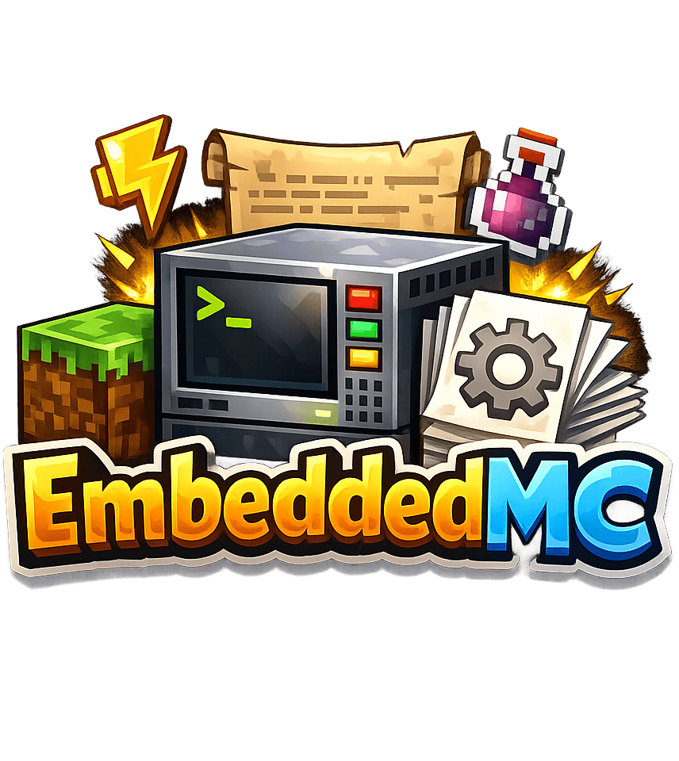

<p align="center">
  
</p>

<p align="center">
  A Fabric mod that lets you run Paper, Purpur, Folia, or Spigot servers directly within Minecraft singleplayer.<br>
  Play with Bukkit/Spigot/Paper plugins in your singleplayer worlds!
</p>

## Features

- **Embedded Server Support**: Run Paper, Purpur, Folia, or Spigot servers alongside your Minecraft client
- **Automatic Downloads**: Server JARs are automatically downloaded from official APIs (PaperMC, PurpurMC)
- **Multiple Instances**: Create and manage multiple server instances with different configurations
- **In-Game Console**: Access the server console directly from within Minecraft
- **Plugin Manager**: Browse and manage installed plugins with built-in config editor
- **File Browser**: Navigate and edit server files without leaving the game
- **One-Click Connect**: Start servers and connect automatically
- **Auto-Start**: Servers start automatically after creation
- **Join Button**: Easy-to-use join button for running servers
- **Configurable Settings**: Customize RAM, port, max players, JVM arguments per instance
- **Multi-Language Support**: English and German translations included

## Requirements

- Minecraft 1.21.11
- Fabric Loader 0.18.0+
- Fabric API
- Java 21+

## Installation

1. Install [Fabric Loader](https://fabricmc.net/use/installer/) for Minecraft 1.21.11
2. Download and install [Fabric API](https://modrinth.com/mod/fabric-api)
3. Download EmbeddedMC and place it in your `mods` folder
4. Launch Minecraft

## Usage

### Creating a Server Instance

1. Click **"Singleplayer with Plugins"** on the title screen
2. Click **"Create"** to create a new server instance
3. Enter a name, select server type (Paper/Purpur/Folia), choose a Minecraft version
4. Configure RAM and max player slots (1-100)
5. Click **"Create"** - the server JAR will be downloaded and the server starts automatically

### Starting and Connecting

1. Select your server instance from the list
2. Click the **Start** button (▶) to start the server - you'll be connected automatically
3. For running servers, click the **"Join"** button to connect
4. Use the keybind (configurable) to open the server console while playing

### Managing Plugins

1. Select a server instance and click **"Plugins"**
2. Click **"Open Plugins Folder"** to add plugin JARs
3. Plugins with configuration files can be edited directly in-game

### Server Console

- Access the console from the pause menu while connected to your embedded server
- Send commands directly to the server
- View server logs in real-time

## Configuration

EmbeddedMC stores its data in the `embeddedmc` folder in your Minecraft directory:

```
embeddedmc/
├── config.json          # Global mod configuration
└── instances/           # Server instances
    └── <instance-id>/
        ├── instance.json    # Instance configuration
        ├── server.jar       # Server JAR file
        ├── plugins/         # Plugin folder
        └── ...              # Other server files
```

### Instance Settings

- **RAM**: Memory allocation (512 MB - 8192 MB, default: 2048 MB)
- **Max Players**: Maximum player slots (1-100, default: 20)
- **Port**: Server port (default: 25565)

### Global Settings

- **Java Path**: Path to Java executable (default: system Java)
- **Auto-Accept EULA**: Automatically accept the Minecraft EULA

## Supported Server Types

| Server | API Support | Notes |
|--------|-------------|-------|
| Paper | Yes | Full automatic download support |
| Purpur | Yes | Full automatic download support |
| Folia | Yes | Full automatic download support |
| Spigot | No | Manual JAR placement required |

## Building from Source

```bash
# Clone the repository
git clone https://github.com/marti/EmbeddedMC.git
cd EmbeddedMC

# Build the mod
./gradlew build

# The built JAR will be in build/libs/
```

## License

This project is licensed under the GNU General Public License v3.0 - see the [LICENSE](LICENSE) file for details.

## Credits

- Built with [Fabric](https://fabricmc.net/)
- Uses [Cloth Config](https://github.com/shedaniel/cloth-config) for configuration GUI
- Server downloads powered by [PaperMC API](https://api.papermc.io/) and [PurpurMC API](https://api.purpurmc.org/)

## Disclaimer

This mod is not affiliated with Mojang, Microsoft, PaperMC, or PurpurMC. Minecraft is a trademark of Mojang AB.
